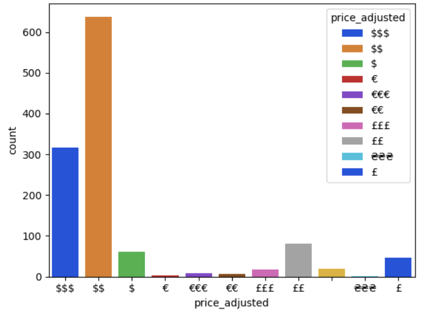

# CSE-151A-Project-
Team members: Emily, Joey, Risab, Christine (Qingtong), Viraj, Sebastian, Justin, Armaan

# Final Submission

# CSE 151A Project: Predicting Restaurant Price Categories Based on Review Data

## Abstract:
As food prices continue to surge, amateur and seasoned foodies are left to question: what qualities or features lead a restaurant to establish their prices? Over the next 6 weeks we plan to answer this question. By leveraging the CSE Google Review dataset, we will (A) create a machine learning model that accurately predicts the price bracket of a restaurant, and (B) determine the statistical significance of each input feature. Specifically, we will train a regression model on sklearn, on engineered features such as geolocation and sentiment derived from text reviews. Since many features of a restaurant such as their food suppliers are not public knowledge, the logic behind restaurant prices is often unseen by its customers. We hope that with the use of feature engineering and machine learning, we can encourage more clarity on what differentiates inexpensive from expensive restaurants.

## Introduction: 
In this project, we dive deep into the pricing strategies of restaurants and coffee shops using a dataset containing Google reviews along with price range, category of the establishment, and the general sentiment of the public towards that establishment and use this information to create different Machine Learning (ML) models which are able to predict the price range. We use a Dense Neural Network, a Support Vector Machine and a XGBoost model, and to ensure that our models perform optimally, we use strategies such as oversampling, balancing the dataset, and tuning the hyperparameters. Before using the 3 different models, we also perform sentiment analysis and convert it to floats to ensure that the text reviews are considered while using the ML models. We also perform accuracy testing on each of the models using a test data set which is a subset of the original dataset randomly sampled without replacement. We think of this as having real life applications for consumers like a restaurant owner who is trying to figure out if their restaurant is overpriced or underpriced according to the food they are serving given their competition. It can also have a huge impact on the people going to these establishments as good food does not always mean good price. We think that predicting price is not something that has been explored as much before and in today’s day and age everything is price sensitive and can make or break a business. Our predictive model also serves as the baseline for much more advanced modeling which can be used by food delivery companies, franchise businesses as well as medium to large chains like Chick-Fil-A and Burger King.

Figures: 
1) 


First, we plotted the count of each rating amongst all the restaurant reviews. Here, we see that the ratings are highly skewed to the right indicating that most people give higher ratings (4 or 5) for the restaurants in the dataset.

2) 



Then we displayed the number of each price label and we see that there are three different currencies: United States Dollar ($), Pound Sterling (£), and Euro (€). We see that most of the price labels fall under the $$ label with the second most falling under the $$$. This could be indicative of businesses trying to stay within a band of affordability.

3) 


Next, we tried to plot the relationship between price labels and ratings to determine whether there is any correlation between the two. What we find is that higher price labels may actually have lower ratings than lower price labels. Despite this, most price labels still tend to fall within an average rating of a four or a five.

4) 


Then we examined the length of reviews and find that most of the reviews are shorter in length.

5)


Lastly, we plotted the relationship between review length and price label and we find that most price labels have similar mean review lengths but the $$ and $$$ have far more outliers than $ which is interesting and might be an area to explore.

## Data Collection: 
We collected data from the CSEweb.edu website. We used the Google Restaurants datasets, which were compiled by Julian McAuley, An Yan, Zhankui He, Jiacheng Li, and Tianyang Zhang. The data were already conveniently stored in a JSON file format.

Specifically, we used two datasets: the places.clean file and the reviews.clean file.

## Data Exploration: 
To understand the significance of all features, we merged the `places` and `reviews` files together. That allowed us to understand the context of feature distributions in the context of our y variable, cost.

To start, we loaded the entire `places` dataset. We also loaded the first 5,000 `reviews`. We chose to only load 5,000 reviews because (A) we were performing computationally costly processing on each review (ie translation, sentiment analysis) and (B) since we were predicting places costs, we wanted to maximize the number of `places` that we loaded, while it was less important to load a lot of reviews.

The entire dataset contained Google reviews of many locations around the world: not necessarily restaurants, and not necessarily in the US. However, most entries used USD ($) to represent price (as compared to other currency euro, pound, etc.)

There were a high proportion of nulls in all variables, as seen on the heatmap.

Most reviews included in the dataset were short; the length of the review was right-skewed, with most reviews including less than 100 words. Most reviews are in English, although the next most common are English, Spanish, simplified Chinese (zh-CN), German, and French. We can see a huge variety of languages used -- almost 40 different types!
In contrast, most place ratings were skewed left, with a majority of locations being rated 4 or 5 stars.

## Preprocessing: 
When handling preprocessing, we had several priorities. Firstly, we wanted the preprocessing to be as cost-efficient as possible. (This was improved in the Model 1 notebook). Secondly, we wanted to convert the data like textual reviews, etc. into usable, ideally numeric, data formats. Thirdly, we wanted to handle nulls in a way that allowed models to understand the lack of data without throwing an error.

#### Preprocessing - Reviews Dataset: 
To preprocess the reviews dataset, we mostly performed feature expansion: generating numeric data from reviews. Examples of the feature expansion that we performed was:
- Identifying and robust-encoding the language of the review (ex: English, Spanish, etc.)
- Performing sentiment analysis and returning the overall sentiment (positive or negative) in terms of a float

#### Preprocessing - Places Dataset: 
To preprocess the places dataset, we had to work through several problems. First, we had to identify which places were restaurants and filter based on those. Then we performed feature expansion by generating features based on the place data.

Firstly, we wanted to identify which locations were restaurants versus not restaurants. Examples of non-restaurant locations in the dataset included gas stations, laundromats, or hospitals. To filter out the locations of restaurants, we identified the first category that the location was tagged with. (We assumed that the first category would be the strongest/most useful in delineating the location.) We then used a Word2Vec library to analyze how similar this category was compared to ‘restaurant’. We used a `threshold=0.5` to filter out only restaurants whose categories are strongly related to ‘restaurant’.

From the 5,000 reviews loaded, only 1943 were deemed relevant. These 1943 were identified using a feature called `relevant_cat`.

Next, we performed feature expansion. Here are some examples of feature expansion that was performed on the features:
We analyzed the categories associated with each location (ex: “Bar”, “Café”, “Sit-Down”, “Casual”) and used K-means clustering to cluster each feature into a cluster.
Note: This was not the supervised KNN algorithm because we did not provide the algorithm with price as an accuracy metric.

#### Preprocessing - Encoding: 
The main encoding that was performed on the dataset was price encoding. For the main dataset, we chose to perform one-hot encoding (robust encoding) on the price values. (Note: we would later have to manually change the encoding to ordinal/label encoding for models 2 and 3).

To perform price encoding, first we converted all non-USD price labels into USD. We know the average price threshold for each price label: $ indicates 10 and under; $$ indicates moderately expensive, usually between $10-$25; $$$ indicates $25-$45. Using this price scheme, we applied the equation `10 * len(symbol) * conversion[symbol[0]]` to convert the price. 
For example, we know that one euro €=$1.08. Therefore based on our equation, a price label of €€ would be equal to 10 * len(€€) * conversion[€] = 10*2*1.08 = $21.60. Since $21.60 is in between $10-$25, the price label would be converted to $$.

Once all the prices were converted to USD symbols, we performed one-hot encoding to convert these symbols into one-hot encoded columns.

#### Preprocessing - Handling Nulls: We handled nulls in several ways. 

Firstly, if there was a restaurant with a null price, we removed this entry. This is because we do not understand the relationship between price and other variables, so we can’t reasonably impute price given variables. (We can see in Model 1 that we chose to “ignore” any entries with null prices when loading the `reviews`).
Secondly, if there were null values in text features, we chose to impute them. For example, if we had a null restaurant name, we replaced it with “Unknown”.
For null values in time features (ie ReviewTime), we imputed with the mean time. This is built on the assumption that the data collectors (McAuley et al) retrieved the Google reviews dataset within certain time bounds. As such, there was a limited range of times that the reviews had, so it was appropriate (or, at the very least, not very harmful) to represent any missing values with a mean.

### Model 1
The results for Model 1 can be found in Milestone_3_JK_Updated.

For the first model, we decided to use a dense neural network (DNN) to predict the price category–using a similar model to that in Homework 2. We utilized a DNN with 4 hidden layers and got optimal hyperparameters via hyperparameter tuning; we did this in the hopes of finding the optimal combination of parameters to maximize accuracy. We searched for the optimal combination of hidden layer activation functions and number of nodes, number of epochs and learning rate. We decided to measure loss with categorical_focal_crossentropy. We further customized the model by adding class_weights to the model and tuner. Finally, the output layer uses softmax as its activation function.
As for preprocessing, we only grabbed numerical columns of the final dataframe. This included clustering, sentiment, and other numerical data. We then one-hot-encoded the price categories and accounted for NaN values in the cluster columns.

We originally excluded class weights, but we updated our model with this feature in the hopes that customizing the model to better fit the problem at hand would produce better results–in terms of accuracy. We attempted different numbers of hidden layers and activation function combinations, but chose hyperparameter tuning in the end so that our final model parameter selections would be numerically optimized instead of just guessed. Finally, we experimented with adding an early stopping mechanism for the hyperparameter tuning but this led our model to fall into a false local maximum by guessing the same class every time (due to our class imbalance).
For generating the DNN, we used the following code:
```
def build_model(hp): 
input_layer = Input(shape=6) 
x = input_layer 
for i in range(4): 
units = hp.Int(f'units_{i}', min_value=8, max_value=18, step=4) 
activation = hp.Choice(f'activation_{i}', ['relu', 'sigmoid', 'tanh']) 
x = Dense(units=units, activation=activation)(x) 
output = Dense(units=3, activation='softmax')(x) 
model = Model(inputs=input_layer, outputs=output) 
lr = hp.Float("learning_rate", min_value=0.0001, max_value=0.3, sampling="log") 
epochs = hp.Int('epochs', min_value=50, max_value=200, step=50) 
model.compile(optimizer=keras.optimizers.Adam(learning_rate=lr),loss='categorical_focal_crossentropy', metrics=['accuracy'], sample_weight_mode=class_weight) 
return model 

tuner = RandomSearch( hypermodel=build_model, objective='accuracy', max_trials=3, executions_per_trial=2, directory='save_directory', project_name='hyperparams_optimization') 

tuner.search(X_train, y_train, epochs=100) 
best_hyperparameters = tuner.get_best_hyperparameters()[0] 
best_model = tuner.hypermodel.build(best_hyperparameters) 
best_model.fit(X_train, y_train, epochs=best_hyperparameters['epochs'])
```
We then used sklearn’s `classification_report` to calculate the precision, recall, and accuracy of the test set. We also calculated training and test error manually by testing equality for each prediction and label.

Model 1 Results: With model 1 and its optimized hyperparameters, we were able to achieve a 65% test accuracy, which is slightly higher than just guessing the class with the most observations every time (see below). This is greater than the training accuracy achieved in hyperparameter tuning, where the max training accuracy was 63.8%. We can see, however, that the model predicts the first result (two dollar signs) for the most part with some guesses of three dollar signs, which conveys underfitting.


### Model 2
The results of Model 2 can be found in the Milestone_4 notebook in Github.

For our second model, we chose to use a SVM classifier to predict price.

We hoped that the kernel trick would allow the model to understand patterns better in higher dimensionality, allowing it to better understand and predict price.
For this model, we leveraged Model 1’s `proc.csv` file as well as leaned on Homework 4 to generate the model.

In terms of preprocessing this CSV file:

- We converted the price from one-hot encoded columns back into label encodings. This was the ideal input for the SVM according to documentation research.
- We removed all non-numeric (string, categorical) columns from the dataset
- We scaled the remaining numerical data using a StandardScaler which returned the standard score $z = (x - \mu) / \sigma$.
   - This assumes a normal distribution of features, which is not guaranteed.

Preprocessing that went omitted:
- We experimented with oversampling the dataset to balance the class weights. However, as described in the discussion section, we chose to omit this step from the final model.
- We also tried applying a grid search to the model. Again, as described in the discussion section, we chose to omit this step from the final model.
- We experimented using the `rbf` kernel with the SVM. However, it did not yield as good of results as compared to linear (see Discussion section).

Model generation: We ended up using this code to generate an SVM model:
```
svm = SVC(kernel = 'linear', class_weight={1.0: 1, 2.0: 1.1160116448326054, 3.0: 1.9847222222222223, 4.0: 11.484848484848484}, decision_function_shape='ovo')
```

Going over the SVC model parameters in order:

We chose to use a linear kernel because, after iterating over the model, it consistently produced the best accuracy.

Class weights were generated by Joey Kaminsky to represent the imbalance dataset. Each key in the dictionary represents the number of dollar signs in the price label.
Decision_function_shape is `ovo`, which is short for `one versus others`. In other words, we set up the model to learn to classify prices knowing that there can only be one correct label, and all other labels will be incorrect for a given instance.

We then used sklearn’s `classification_report` to calculate the precision, recall, and accuracy of the test set. We also calculated training and test error manually by testing equality for each prediction and label.


### Model 2 Results:
We achieved a training accuracy of 63% and a test accuracy of 60%.  This translates to a relatively high performance for the model.
```
[list(y_test.cost)[i] == y_test_pred[i] for i in range(len(y_test_pred))]
```
However, when viewing the prediction distribution, we can see the model predictions are heavily skewed towards predicting $$. 

### Model 3
For our third model, we implemented an XGBoost classifier to predict the price category of a restaurant. 

For this model, we leveraged the first model’s ‘proc.csv’ file. We encoded each of the different price categories using integers according to the category and split the dataset to get our testing and training data. We then scaled our training data using a standard scaler. 

Model generation: We generated the model using the below parameters
```
xgb = XGBClassifier(
   n_estimators=2, max_depth=2,
   learning_rate=1,
   objective='multi:softmax',
   eval_metric='merror',
   #scale_pos_weight=
)
```
We chose to use the objective of ‘multi:softmax’ and ‘merror’ because they were the most relevant to the multiclass classification problem we were trying to develop a model for below.

Our initial XGBoost model used `n_estimators=100`, specifying that the ensemble would contain 100 trees. In order to counteract the potential overfitting of this value, we ensured that each tree would remain simple with a max depth of 2. This model was intended to serve as a basis to compare to our future iterations via grid search where we evaluated performance with a variety of parameters intended to manage overfitting and underfitting.

Our grid search featured the following parameters:
```
xgb_gridsearch = XGBClassifier(objective='multi:softmax', 
eval_metric='merror')


param_grid = {
    'max_depth': [3, 4, 5],
    'learning_rate': [0.1, 0.5, 1],
    'subsample': [0.6, 0.8, 1.0],
    'gamma': [0.0, 1.0],
    'colsample_bytree': [0.5, 1]
}


grid_search = GridSearchCV(estimator=xgb_gridsearch, 
param_grid=param_grid, scoring='f1_macro', cv=5, verbose=1
```

We explored three options for `max_depth`, `learning_rate`, and `subsample` and two options for `gamma` and `colsample_bytree`. The `max_depth` describes the maximum depth each model in the ensemble can reach. The `learning_rate` specifies the step size after each boosting step. `subsample` indicates the ratio of observations (rows) that will be randomly sampled during training. Randomly sampling a portion of the data could help prevent overfitting as it diversifies the training data between each model in the ensemble. `colsample_bytree` similarly samples a portion of the dataset, however, rather than sampling a proportion of rows, it samples a proportion of the columns. `gamma` introduces a threshold for partitioning on a leaf node—if `gamma` is not 0, the model will not introduce a new leaf if the change in loss is minimal.

Our grid search employed five-fold cross validation and used `f1_marco` as a scoring method, which performed better than the alternatives in our testing.

We then used sklearn’s `classification_report` to calculate the precision, recall, and accuracy of the test set. We also calculated training and test error manually by testing equality for each prediction and label.

From our classification report, we noticed that the model defaulted towards our largest 2 classes. We implemented a random over sampler with a sampling strategy as seen below: 
ros = RandomOverSampler(
   sampling_strategy={
       0: 500,
       1: 300,
       2: 200
   }
)
Using the random over sampler to oversample our training data, we then tested our model again to see if our results changed in any way through our classification report.

We also employed a grid search with the same parameters discussed above in conjunction with our oversampled training data set.

### Model 3 Results
Our initial XGBoost model produced a training accuracy of 0.67 and test accuracy of 0.58, however it heavily biases towards the default classes—it failed to predict every item not falling into the primary two classes.

The oversampled model expectedly sacrificed accuracy for slightly more balanced predictive output. However, in this case, oversampling did not provide much value as the minority class predictions were inaccurate. Still, possibly due to favorable train/test partitioning, the model outperformed our base XGBoost model with a training accuracy of 0.59 and test accuracy of 0.61. The oversampling also appeared to help counteract overfitting.

The grid search produced disappointing results with the best (training) model overfitting and producing a training accuracy of 0.67, a test accuracy of 0.54. The model once again ignores the minority class entirely. The oversampled grid search model also performed poorly with a training accuracy of 0.50 and test accuracy of 0.51.

The model would likely have performed better given more training data and a deeper exploration of the ideal set of parameters. However, with the smaller dataset, the model struggles to overcome the overfitting issues often found in tree-based models. 

## Discussion: 
With data exploration and preprocessing, we noticed the class imbalance present in our dataset right away; therefore, we explored models and methods that could potentially weigh in class weights to improve the accuracy of the model. This led us to select our three models and to utilize class weights and oversampling. Furthermore, we needed to convert all entries into the same format, which led us to translate reviews to English. Additionally, we wanted to make use of the non-numerical data present in our dataset, specifically reviews and categories. This led us to make use of sentiment analysis and label-encoding techniques to convert string columns into numerical ones. Due to the nature of the preprocessing–specifically how we could only parse 5,000 reviews before utilizing all of Google Colab’s designated RAM–we were limited in the data available; this led us to be creative in our models such as creating new features like ‘money-related words’ and category clusters. Now we will go into each model more specifically:

### Model 1
With this model, we utilized 4 hidden layers as we felt that this would balance out overfitting and underfitting. Additionally, we chose to go in the direction of hyperparameter tuning to optimize the activation function and number of nodes, learning rate, and number of epochs in order to achieve maximum accuracy. While we attempted to use early stopping, this made our model susceptible to predicting the most common class every time, which forced us to ditch the idea. Instead, we used class weights via ’compute_class_weight’ to let the model account for the class imbalance. Furthermore, categorical_focal_crossentropy was used to measure loss as it is best at accounting for multiclass classification for imbalance classes. We then ran the hyperparameter tuning on accuracy in order to maximize model accuracy. While we did all these things, the model still fell victim to predicting the first class for the majority of the predictions–with few guesses of other classes, as seen below. Our results are not all that believable as not every restaurant falls into the category of two dollar signs. This can be attributed to the class imbalance, where our models were unsuccessful in preventing the model from that most common class too frequently; the shortcomings that could have led to this could have been not enough variety in hyperparameters tested (for example, hidden layer number of nodes could only vary between 8 and 18) and lack of oversampling. 


### Model 2
For this model, our intention was to leverage the kernel trick to reduce complexity of the problem and better predict the cost of locations. We also wanted to tackle the imbalance dataset, which was, when left unaddressed, causing the model to only predict the most frequent class label.

To do this, we experimented. 

#### First attempt: Oversampling (Removed)
First, we tried oversampling to “fix” the dataset and ensure the model was training on all classes.
```
from imblearn.over_sampling import RandomOverSampler
ros = RandomOverSampler(random_state=42)
X_res, y_res = ros.fit_resample(X, y)
```
This resulted in the model learning from a balanced dataset and predicting equal proportions of labels. However, since the test set is not balanced, this led to low accuracy:


Therefore while this might have taught the model about how to discern different cases, it is not helpful in the “real-world application” of the test set. Therefore, we chose to depreciate or exclude this method from the real-world application.

#### Second attempt (Success!): Using class weights (Final Version of Model)
We still wanted to compensate or “fix” the problem of the imbalanced dataset. However, we could tell from the first attempt that oversampling made accuracy decrease, even though it taught the model more about different classes.
The next attempt to tackle the imbalanced dataset problem was to use class weights. Class weights allow us to manipulate the C (regularization parameter) for each class. Basically, the C value informs the SVM how large of a margin (strict or soft) should be allowed when separating classes. The larger the C-value, the smaller/stricter the margin.
Knowing this, we used sklearn’s `compute_class_weight` method and fed in the class weights into the SVC initialization. We ended up with weights of
```
{1.0: 1, 2.0: 1.1160116448326054, 3.0: 1.9847222222222223, 4.0: 11.484848484848484}
```
We ran the model and got the results as described in the Results section: a training accuracy of 0.63, with a test accuracy of 0.60. Since this is the highest test accuracy we have encountered, we chose to keep this processing technique for our final model.

#### Third attempt: Applying grid search (Removed)
We then tried to perform hyperparameter tuning on the SVM, hoping that it would result in higher performance. This would allow us to use tuned parameters like `C` and `gamma` in the SVM.

The grid search took about 15 seconds to run. Printing out the results returned this:


We updated the model using `C=1000` and `gamma=0.001`.
```
svm = SVC(C=1000, gamma=0.001, kernel = 'rbf', class_weight={1.0: 1, 2.0: 1.1160116448326054, 3.0: 1.9847222222222223, 4.0: 11.484848484848484}, decision_function_shape='ovo')
```
This resulted in a training accuracy of 0.57. To get more information on our results, we also manually calculated the label accuracy.


We can see that the training accuracy was 0.67, while the test accuracy was 0.53. In other words, there was a high training accuracy, but a low test accuracy. This was a red flag for us: we suspected grid search led to overfitting the SVM. We chose to remove the grid search from the final model iteration. (You can stil see the grid search code commented in the Milestone 4 jupyter notebook).

#### Evaluating our Final Model 2:
When looking at our results table, we can see that the model still predicts predominantly $$ and $$$ labels.


The model never predicts $$$$ (4 dollar signs), but there are only 3 instances of $$$$ in the test set. This suggests that the model is still “coasting”/performing well based on the imbalance dataset and less because it understands the nuances separating the classes.

### Model 3
We chose to use XGBoost due to its similarities to random forest training, however it additionally also has a “gradient boosting” property that enables it to perform more effectively. Due to it being an ensemble learning algorithm, it is able to compensate for weaker performance in one model through the use of several models and minimizing errors. We hoped that it would be able to perform better in comparison to our previous two models.

Initially, we ran the model on our processed data. We found that our model heavily favored the 2 largest price classes, ignoring the lowest price class. When analyzing the value counts, we found that this was most likely due to the significant disparity in data and the general lack of data for the smallest price class. As a result, we used a random oversampling strategy to test if our model would perform better if we oversampled our data. However, when training our model on oversampled data, though we saw the precision and recall of these classes rise, we actually saw the accuracy go down. This was most likely due to the fact that even in the training data the smallest price class is so uncommon and it makes sense for our model to askew heavily toward the more common price classes.

In hopes of increasing the accuracy of our model, we attempted to use XGBoost gridsearch to try different parameters to potentially improve our model. However, we found that the accuracy did not seem to improve significantly, even going down in some cases. Nevertheless, we believe the shortcomings of our model stem more from a lack of a diverse dataset as opposed to the model itself. Additionally, the parameters we chose to reduce complexity and overfitting may have additionally ended up harming our model more as that lack of complexity may have made it harder for our model to generalize to unseen data. 

## Conclusion
All three of our models were not able to fully escape the issues presented by class imbalance in price category. While some were more successful than others in predicting other classes, for the most part, the two dollar sign category was typically the most predicted class; this led our models to be capped at an accuracy of roughly 65%. Due to the fact that our models were unable to differentiate the different price categories beyond a 65% accuracy (where the majority of the correct predictions were for the two dollar sign price category), we cannot accurately determine how each input feature factors into a restaurant’s price range. 

If given more time and more computational resources, we would include more reviews into our dataset to get a hopefully more diversified collection of restaurant price ranges. Furthermore, we would be able to create new features that grouped together different clusters of data, which could potentially provide better insights for our models in predicting price categories. We were limited in creating new features due to the limited amount of data we had. For example, we attempted to categorize based on restaurant category, which led to ~90 categories for a limited dataset. Because only a limited number of data points fell into each category, this labeling was not useful for our classification problem. More data could have made these labels a more interesting feature for our models. Finally, if we had the option to create a fourth model, we could have explored decision tree learning. This model is more susceptible to overfitting than underfitting; we could have leveraged this model to identify how we could escape the issue of underfitting in the other models.

We would also like to use geo-location features more accurately to create a more precise prediction based on the locations as well as we would expect restaurants in more expensive cities or neighborhoods to be priced higher. Despite the ~60% accuracy we were able to achieve, having more data and a couple of more features like geolocation might improve performance. 

We believe that this project provides valuable insight into how different models and data processing techniques impact a highly-dimensional prediction problem. Our analysis of DNNs, SVMs, and XGBoost along with kernels, grid search, feature engineering, and class imbalance is a useful jumping-off point for future research into how to effectively and efficiently tackle complex prediction problems.

## Collaboration: 
Joey - Joey helped with coordinating group meetings, topic selection, sentiment analysis and minor preprocessing, DNN model creation and updating, integrating model weights into the models, and different write-up contributions.

Emily - Emily helped manage everyone during each meeting. Contributed to Milestone 1 by performing translation and restaurant-relevance-filtering. Contributed to Milestone 1 write-up. Rewrote Milestone 1 work to create a more efficient proc.csv datafile (which is used in every subsequent model). Created first model (except grid search from Joey). Created second model, SVM (additions from Joey and Armaan for clas weights, grid search.) Wrote up the second model assignment. Wrote data exploration and preprocessing methods + methods, results, and discussion for Model 2. Converted all write-ups to Github README format.

Risab - Risab helped with topic selection, imputation of null and missing data in data preprocessing, XGBoost model creation and updating with Seabastian, oversampling data for XGBoost, tuning of different models, and different write-up contributions, particularly method/discussion of XGBoost model and revision of conclusion.

Sebastian - Sebastian contributed with topic/dataset selection, initial creation of the XGBoost model with Risab, architecting the hyperparameter tuning/cross validation used for optimizing the XGBoost model, adding discussion for the XGBoost model, parameter descriptions, and results to the writeup.

Armaan - Armaan helped with topic selection, initial data exploration and plotting relationships in the data, normalization in data preprocessing, SVM parameter finetuning, and different write-up contributions.

Justin - Justin helped with data evaluation, breaking down names of restaurant names, and converting other currencies to USD. Helped build model for model 1 and write-up contributions.

Viraj - Viraj helped with introduction and a part of the conclusion and helped in choosing the dataset along with research question, Also created one of the sub-models for XGBoost Classifier using SMOTE.

Christine (Qingtong) - Contributed to Model 1 preprocessing data/write up: she tackled gps converting coordinates and one-hot encoding the price bracket.

---

3/10/24 Note: Joey Kaminsky improved Model 1 (from Checkpoint 3) by 5% (up to 65% testing accuracy) by using class weights, early stopping, and utilizing softmax activation function in both the hidden and output layers. This is due to the imbalance present in our data, where getting the class weights can help the model understand the imbalance data better. Additionally, the addition of early stopping and softmax activation function allow the model to achieve high accuracies by avoiding overfitting issues and explore different activation functions that best fit the problem at hand, respectively. While this is a slight improvement to our model, we are still dealing with the issue of the model underfitting due to trying to predict the first class too often–due to its higher frequency in the data. We try to fix this issue in the SVM model (model 2). The updates can be found in the notebook `Milestone_3_JK_Updates.ipynb` or at this link: https://colab.research.google.com/drive/10ver3YLrlP45MuUj6kbIVuZaNE3fF7jx#scrollTo=L7tX2TnysAvE.

# Milestone 4

#### 3. Evaluate training versus testing error.
Our SVM Classifier model from Milestone 4 has a training error of 0.63 and a test error of 0.60.

For context, our Milestone 3 Model 1 had a training error of about 65%, with testing error around 59.5%.

Overall, the training error decreased while the test error increased trivially.

#### 4. Where does your model fit in the fitting graph?

This SVM model is less underfitting. In the fitting graph, it would be more right (closer to ideally fitted) compared to the first model.
In contrast, the Model 1 usually only predicts $$ with only a few rare outlier predictions of $$$. It therefore had a high training and test error.
This second model (SVM) predicts more evenly (possibly thanks to the class weights)

#### 5. Did you perform hyper parameter tuning? K-fold Cross validation? Feature expansion? What were the results?

We performed the following:

Hyperparameter grid search: This took about 5+ minutes to run and iterated through C, gamma, and kernel options. This increased training error and overall accuracy but decreased test error. Eventually, we deemed this change to not be helpful in increasing model performance (not implemented in final model)

Class rebalancing: We used `imblearn.over_sampling` to rebalance the dataset. While this increased accuracy by about 5% (compared to the unbalanced dataset), we determined that changing class weights instead of resampling actually increased performance more. Therefore we switched to class weights (not implemented in final model)
Class weights: Fed in class weights to the SVM model to help it increase accuracy. It increased performance (overall accuracy) by about 10%.

#### 5. What is the plan for the next model you are thinking of and why?

The next model we are going to try is XGBoost (a boosted decision tree model). It is known for being a powerful model and performing well when synthesizing complex tabular data. Hopefully it will capture the complex nature of our data and class imbalances. Another positive is that there is less preprocessing needed for the decision tree to understand/leverage features.

#### 6. Colab Link: 

https://colab.research.google.com/drive/1fVuWdEJfC3t6FoNlaJaenktjRcf1XFpx?usp=sharing

#### 7. Conclusion

The conclusion of our 2nd model is that it performed well/better than the first model. We can see from decreasing train/test error as well as looking at the raw predictions that it is predicting a more diverse range of outputs. (I.e., it’s not just predicting the same value for any input).

To possibly improve model performance we could:

- Continue to work with the class rebalancing/class weights to see if changing/iterating those would improve performance
- Feature expansion on the existing features (more context/data for the model to work with)
- Vectorize the text inputs that our proc.csv provided ⇔ gives the model more data about reviews, restaurant names, etc. Possibly perform more complex word vectorization like sentiment analysis, positive/negative sentiment as well.
- Increase dataset size (go back into the data processing stage, use more samples) ⇔ leverage unreasonable effectiveness of data to improve model performance

# Milestone 3

#### 3. Evaluate training versus testing error.

Our training error is about 65%. Our testing error is 59.5%. While these numbers are high, we suspect that this is a result of an imbalanced dataset, and in reality our model is underfitting to the prediction problem. More information on that in section 4.

#### 4. Where does your model fit in the fitting graph?

We believe our model is underfitting the classification problem. The only reason we’re seeing the difference between training and testing error is because it’s consistently predicting the first class (`$$`) and the training data has a lot of that class. Therefore the model predicts with high accuracy (about 65%) in training. However, in testing, where the test data has a different class distribution, the accuracy is lower (see the confusion matrix).
This suggests that the model is underfitting.

Our data consists of unbalanced distribution of restaurant price categories, where the overwhelming majority have two dollar signs. This led our first model to underfit our data, where it predicts almost the same class (a price category of two dollar signs, `$$`) every time regardless of the data. This can be seen by looking at the confusion matrix: 


Each column represents the predicted class. We can see an overwhelming majority of predictions lie in the first column for class 1 (`$$`) with only 11 predictions for class 2 (`$$$`) and no predictions for class 3 (`$$$$`).
Each row represents the true class value. These rows show that in reality there are 105 predictions in class `$$` (see first row summed), 100 predictions for class 2 (`$$$`), etc.
Basically, we can see that the model consistently predicts the first class (`$$`) and most test cases are `$$`. 

This suggests the model predicts the most common class most of the time, but doesn't understand how to differentiate classes. This suggests **underfitting.**

#### 5. Which are the next 2 models you plan to add and why?

In our future work, we plan to implement an XGBoost model and an SVM to determine whether different model architectures can better understand and predict this classification problem.

XGBoost implements an ensemble of models trained to overcome the weaknesses of the others overlaid on a base decision tree model. The nature of the model supports the finetuning of various hyperparameters (max depth, learning rate, lambda, alpha, etc.) to counteract overfitting. These additional parameters could be particularly helpful as we attempt to overcome issues regarding underfitting and overfitting.

SVM was described in class and we think it would be interesting to apply to a multiclass classification problem, especially using the kernel trick to add dimensionality and possibly create better decision boundaries.

#### 6. Colab Link: 

https://colab.research.google.com/drive/1rsKRfCgZOV-R0u1Pj4pfU-P5DVu6IIv6?usp=sharing

#### 7. Conclusion

For our first model, we decided to use a DNN with hyperparameter tuning to predict price category. We selected this model as it can take in complex data and apply functions to predict multiclass labels. To implement this model, we used a similar method to the one used in homework 2, where we test different combinations of activation functions, nodes in hidden layers, learning rate, and number of epochs to see which combination can produce the best accuracy. We hard coded the following: 4 layers to make the neural network complex but not too complex, the loss function binary_focal_crossentropy (due to the class imbalance present in our data), and the output layer activation function to be softmax–so that probabilities for each prediction summed up to 1.

We chose not to use image data for our first model, despite the dataset providing this information. This is because we reasoned that images attached to Google restaurant reviews could be anything: food, the outside of the restaurant, a bug, something completely random. Therefore it might not be very indicative of the price of the restaurant. Moreover, classifying these images as “what they are” and then deciding the impact on price might take too much resources for a Google Colab notebook. Therefore we decided to not use the image data provided.

As described in section 4, we believe our model is underfitting on the prediction problem. This could be a result of data imbalance (there are only 3 test cases which are $$$$, so the model might learn to never predict $$$$ to maximize accuracy). This could also be a result of a small dataset; a test size of 200 and a training size of about 1700 is not usually large enough for an ANN to properly grasp data distributions.

There are multiple ways we can improve this model. For one, we could add more layers to the neural network to better understand and “break down”/understand the data inputs. Another huge way is to understand the different activations functions and which one works the best given our model along with the optimiser which would improve with hyperparameter tuning. We could also try to balance the dataset to get better overall accuracy for each class.

As mentioned previously, one solution could be to add more data to the model. The limited size of our dataset (due to the computational complexity of our preprocessing steps and the RAM limitations of Colab) may have contributed to the underfitting our initial model experienced. However, since we are using Colab with limited RAM, we do not konw if this is technically feasible. The data preprocessing pipeline (including translation) is very computationally taxing. So increasing the amount of data may or may not be possible given our current resources.

# Milestone 2
Colab Notebook link: https://colab.research.google.com/drive/1bjhNxm6oj0MIGyFm1_xxBMnk-qcns9mw?usp=sharing#scrollTo=xy1WmqThhDQh

You can also find the downloaded Jupyter Notebook in the Github directory.

### Data Preprocessing
Our data preprocessing pipeline takes several steps.

#### 1\. Load our data

1A. We downloaded two Google datasets: "places.clean.json" and "reviews.clean.json". These datasets can be found here: https://datarepo.eng.ucsd.edu/mcauley_group/data/googlelocal/
- "places" stores Google locations
- "review" stores the corresponding Google reviews.

For more information on these 2 datasets, see ["Table descriptions"](#table-descriptions)

When loading the two datasets:
- Loaded only the first 5,000 reviews for this EDA
- Dropped unnecessary columns when loading datasets
  - Removed `phone`, `hours` from places dataset
  - Removed `reviewerName`, `phone`, `hours` from review dataset 
- Used `urllib` and `gzip` to access these files straight from the CSE webpage URL.

1B. Merged the two datasets together using the primary key "gPlusPlaceID" (which represents the Id associated with the business).
- Used a left join on the reviews dataset

#### 2\. Clean existing columns
- Converted price (originally a *string* ranging from "$" to "$$$$$") into an ordinal variable
- Converted reviewTime (originally a *string*) into a datetime object
- Converted `gps` into a geographical object so we can compare distance, geography, etc. between restaurants as a feature

#### 3\. Create new columns
- `language`: *String* - Language of the original review. Used a Google Translate API on reviewText
- `translated`: *String* - English text of the review, translated into English if not already in English. Used a Google Translate API on reviewText
- `top_category`: *String* - Top category associated with the business. Used TF-IDF
- `relevant_cat`: *bool* - True if top_category is related to a restaurant, False if otherwise. Used a Word2Vec machine learning model to identify relevance of the words in `top_category` compared to the word "restaurant" and used a threshhold to categorize True/False relevance.
- `cat_cluster`: *float64* - Cluster restaurants into one of 5 categories based on top_category. Used a Kmeans clustering model to group restaurants based on their `top_category`. For more information about the groups generated, look at the EDA code
- `sentiment`: *object* - Sentiment analysis of the review. Includes negative, neutral, and positive sentiment as well as the compounded sentiment (overall sentiment based on negative, neutral, and positive sentiment). Used the vaderSentiment package to get the negative, neutral, and positive sentiment from `translated`; from this, we also got the composite sentiment to see whether the rating was positive, negative, or neutral overall.
- `charged_words`: *object* - List of words that influenced the sentiment analysis of the review. Generated from vaderSentiment (see `sentiment`)
- `price_words`: *object* - List of words relating from the review that relate to their opinion of the pricing of the business. (EX: "overpriced", "great deal", "not worth the cost"). Generated from vaderSentiment (see `sentiment`)
- `longitude`, `latitude`: *String*, *String* - We convert the GPS coordinates provided in string format ([latitude, longitude]) into two separate columns, namely latitude and longitude.
- `geo_Kmeans`: *Int* - To identify patterns and group restaurants with similar geographical locations, we implement KMeans clustering. Currently, the number of clusters is set to 200, which can be changed later.
- `location_obj`: *object* - We leverage the GPS pairs to generate a detailed location object for each restaurant. This object includes essential geographical information such as the road, city, postal code, and country.
- `class_$$`, `class_$$$`: *Int* - In addition to geographical details, we hot-encode the price bracket of each restaurant. If the restaurant has a price = $$, there is a 1 in the `class_$$` column and a 0 in the `class_$$$` column. Vice-versa if the price = $$$.

#### 4\. Imputation
- `reviewTime`, `unixReviewTime`: `None` is imputed with mean time
- `name`: `None` is imputed with 'Unknown'
- `closed`: `None` is imputed with 'False' (assumes the place/location is still open)

#### 4\. Normalization
- `price`: normalized all symbols to USD (from other currency characters like yen (¥), euro (€), etc.)

### Dataset Descriptions
#### ***Reviews Dataset***:

- **Row** - Corresponds to one review
- **Columns (6)**
    - **rating**: *float64* - A value from [1, 2, 3, 4, 5]
    - **reviewText**: *object* - review text of the specific business
    - **categories**: *object* - List of Categories associated with the business
    - **gPlusPlaceId**: *object* - Id associated with the business
    - **unixReviewTime**: *float64* - Represents the time the review was made in Unix Formatted time
    - **reviewTime**: *object* - Represents the time the review was made in human-readable format

#### ***Places Dataset***:

- **Row** - Corresponds to one place
- **Columns (6)**
    - **name**: *object* - Name of the place
    - **price**: *object* - categorical price-range of the business, ranges from $ to $$$$
    - **address**: *object* - Address of the place
    - **closed**: *bool* - True if place is closed False otherwise
    - **gPlusPlaceId**: *object* - Id associated with the place
    - **gps**: *object* - Latitude and Longitude of location of the place

#### ***Added Columns****
- **Row** - Corresponds to one review
- **Columns (8)**
    - **language**: *String* - Language of the review
    - **translated**: *String* - English text of the review, translated into English if not anlready in English
    - **top_category**: *String* - Top category associated with the business
    - **relevant_cat**: *bool* - True if top_category is related to a restaurant, False if otherwise
    - **cat_cluster**: *float64* - Cluster restaurants into one of 5 categories based on top_category
    - **sentiment**: *object* - Sentiment analysis of the review. Includes negative, neutral, and positive sentiment as well as the compounded sentiment (overall sentiment based on negative, neutral, and positive sentiment)
    - **charged_words**: *object* - List of words that influenced the sentiment analysis of the review
    - **price_words**: *object* - List of words relating from the review that relate to their opinion of the pricing of the business
